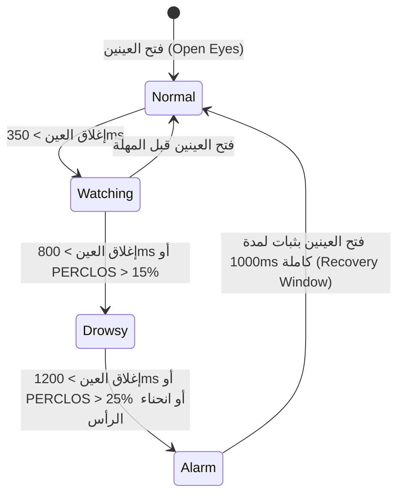

# 🚗 Safe Drive Monitor (نظام مراقبة يقظة السائق وتفادي النعاس)

[](https://flutter.dev)
[](https://www.tensorflow.org/lite)
[](https://developers.google.com/ml-kit)
[](https://www.android.com)
[](https://github.com)

**Safe Drive Monitor** هو تطبيق متقدم ومفتوح المصدر مبني باستخدام Flutter و TensorFlow Lite و Google ML Kit، يعمل بالكامل **محلياً على جهاز السائق بدون الحاجة إلى اتصال بالإنترنت (100% On-Device & Privacy Preserving)** لمراقبة عيني ووجه السائق في الوقت الحقيقي وتنبيهه فورياً عند النوم أو الإجهاد الشديد لتفادي الحوادث المرورية.

---

## 🌟 الميزات الرئيسية (Key Features)

1. **تتبع وجه السائق الحصري وعزل الركاب (Driver Face Tracking & Passenger Rejection)**:
   - يعمل بدمج **Google ML Kit Offline** للتعرف على معالم الوجه والعينين.
   - يحدد الوجه الأكبر والأقرب للكاميرا (السائق) ويتتبع معالم `trackingId` مع تنعيم الإحداثيات بخوارزمية **Exponential Moving Average (EMA)** لمنع اهتزاز الإطار عند المطبات.
   - يتجاهل وجوه الركاب في المقاعد المجاورة تلقائياً.

2. **معالج الإطارات المباشر فائق السرعة (Direct ROI Zero-Allocation Preprocessor)**:
   - يحول بكسلات الكاميرا الخام (`YUV420` / `NV21` / `BGRA`) مباشرة إلى مصفوفة الإدخال (`Float32List [1, 224, 224, 3]`) بدون أي تخصيصات ذاكرة مؤقتة (Zero-Heap Allocation).
   - زمن المعالجة فائق السرعة **أقل من 2 ميلي ثانية (< 2ms)** لكل فريم.

3. **حساب نسبة إغلاق الجفون العالمية (PERCLOS Rolling Window)**:
   - يقيس معيار السلامة العالمي المعتمد في هندسة السيارات (PERCLOS - Percentage of Eye Closure) عبر نافذة زمنية متحركة مدتها **60 ثانية**.
   - يكشف النعاس والإجهاد المتراكم بدقة عالية حتى في حالات الرمش المتقطع الخادع.

4. **كشف انحناء الرأس للأمام (Head Nod Pitch Detection)**:
   - يدمج زاوية ميلان الرأس (Head Euler Pitch < -20.0°) مع إغلاق العينين لإطلاق إنذار فوري ومبكر عند استسلام السائق للنوم المفاجئ.

5. **تردد الاستدلال التكيفي الموفر للطاقة (Adaptive Inference Throttling)**:
   - يعمل بتردد اقتصادي هادئ **~6 FPS** في حالة اليقظة لتوفير البطارية ومنع سخونة الهاتف.
   - يتسارع تلقائياً إلى **~16 FPS** فور اشتباه التحديق أو النعاس لتوفير استجابة فورية.

6. **حارس الكاميرا التلقائي (Camera Stream Watchdog)**:
   - يراقب نبضات الفريمات باستمرار؛ وفي حال حدوث تجميد في البث (> 2.5 ثانية) بسبب مكالمة واردة أو انقطاع في النظام، يقوم بإعادة تشغيل الكاميرا تلقائياً دون تدخل يدوي.

7. **موثوقية صوت الإنذار وإدارة التركيز (AudioFocus Ducking & High Priority)**:
   - يطلق الصوت عبر قناة الإنذار عالية الأولوية (`STREAM_ALARM`) متخطياً وضع الصامت والوسائط.
   - يقوم بخفض أصوات تطبيقات الموسيقى والملاحة تلقائياً (`Audio Ducking`) مع نمط اهتزاز تحذيري متكرر.

8. **شاشة القيادة الليلية وانعكاس الزجاج (Driving Mode HUD & Windshield Projection)**:
   - واجهة AMOLED داكنة عالية التباين خالية من التشتيت.
   - **خاصية عكس الشاشة (Windshield Mirror)**: قلب الشاشة أفقياً بنقرة زر لعكس الصورة وقراءتها مباشرة على الزجاج الأمامي للسيارة ليلاً.

9. **كاشف القيادة الليلية والإضاءة المنخفضة (Low-Light Detection)**:
   - يحسب متوسط إضاءة الإطار ($\bar{Y}$) فورياً ويظهر تنبيهاً ذكياً عند انخفاض إضاءة مقصورة السيارة.

---

## 🧠 تفاصيل نموذج الذكاء الاصطناعي (Model Specifications)

| المعيار | القيمة |
| :--- | :--- |
| **Model Path** | `assets/models/eye_state_model_tensorFlow.tflite` |
| **Input Shape** | `[1, 224, 224, 3]` (Float32) |
| **Normalization** | `(pixel - 128.0) / 128.0` $\rightarrow$ Range `[-1.0, 1.0]` |
| **Output Shape** | `[1, 2]` (Index 0: **Open**, Index 1: **Closed**) |
| **Inference Engine** | TensorFlow Lite / LiteRT Native Bindings |
| **Memory Strategy** | Direct native pointer Float32 buffers & Preallocated tensors |

---

## ⏱️ المنطق الزمني وحالات التنبيه (Temporal State Machine)



---

## 📁 هيكلية المشروع (Project Architecture)

```text
lib/
├── app/
│   ├── app.dart                                # تهيئة التطبيق الأساسي
│   └── theme/                                  # سمات وألوان التصميم الداكن
├── core/
│   ├── constants/app_constants.dart           # الثوابت والإعدادات الافتراضية
│   ├── errors/app_exceptions.dart              # إدارة الأخطاء والاستثناءات
│   ├── services/                               # خدمات الصوت والاهتزاز
│   └── utils/                                  # دوال التوقيت وسجلات الأداء (AppLogger)
├── features/drowsiness_detection/
│   ├── data/services/
│   │   ├── camera_service.dart                 # إدارة الكاميرا وبث الفريمات
│   │   ├── eye_state_classifier.dart           # تصنيف حالة العين عبر TFLite
│   │   ├── face_detection_service.dart         # كشف الوجه دون اتصال عبر ML Kit
│   │   └── image_preprocessor.dart             # المعالج المباشر فائق السرعة Direct ROI
│   ├── domain/
│   │   ├── entities/                           # كائنات البيانات (Prediction, Face, Config, State)
│   │   └── services/
│   │       ├── camera_stream_watchdog.dart     # حارس استعادة الكاميرا التلقائي
│   │       ├── driver_face_tracker.dart        # تتبع وجه السائق وتنعيم الإحداثيات
│   │       ├── drowsiness_analyzer.dart        # آلة الحالات الزمنية لكشف النعاس
│   │       ├── legacy_decision_analyzer.dart   # المقارنة المعيارية مع خوارزمية جافا
│   │       ├── low_light_detector.dart         # كاشف الإضاءة الليلية المنخفضة
│   │       └── perclos_calculator.dart         # حاسبة مؤشر إغلاق الجفون (60s Window)
│   └── presentation/
│       ├── providers/
│       │   └── drowsiness_detection_provider.dart # مدير الحالة المركزي
│       ├── screens/
│       │   ├── driver_monitor_screen.dart      # الشاشة الرئيسية التفاعلية
│       │   ├── driving_hud_screen.dart          # شاشة القيادة المظلمة وانعكاس الزجاج
│       │   └── safety_disclaimer_screen.dart   # إرشادات السلامة وإخلاء المسؤولية
│       └── widgets/                            # مكونات الواجهة وشاشات المراقبة
└── main.dart                                   # نقطة الانطلاق وتثبيت الاتجاه
```

---

## 🚀 طريقة التشغيل والاختبار (Getting Started)

### المتطلبات الأساسية
- Flutter SDK (الإصدار 3.22+ أو أحدث).
- هاتف يعمل بنظام Android (يدعم كاميرا أمامية).

### الأوامر
1. **تثبيت الحزم والمكتبات**:
   ```bash
   flutter pub get
   ```

2. **تشغيل فحوصات الجودة والتحليل الثابت**:
   ```bash
   flutter analyze
   ```

3. **تشغيل اختبارات الوحدة الشاملة (Unit Tests)**:
   ```bash
   flutter test
   ```

4. **تشغيل التطبيق على الهاتف**:
   ```bash
   flutter run --release
   ```

---

## 🔒 الخصوصية والأمان (Privacy & Safety)
- **100% On-Device Processing**: لا يتم حفظ أو تسجيل أو إرسال أي صورة أو إطار فيديو خارج الهاتف على الإطلاق.
- **تنبيه قانوني**: هذا التطبيق أداة مساعدة إضافية لتعزيز السلامة المرورية، ولا يغني عن الراحة الكافية والتوقف الآمن عند الشعور بالإرهاق.

---

## 📄 الترخيص (License)
هذا المشروع مرخص تحت رخصة MIT License.
